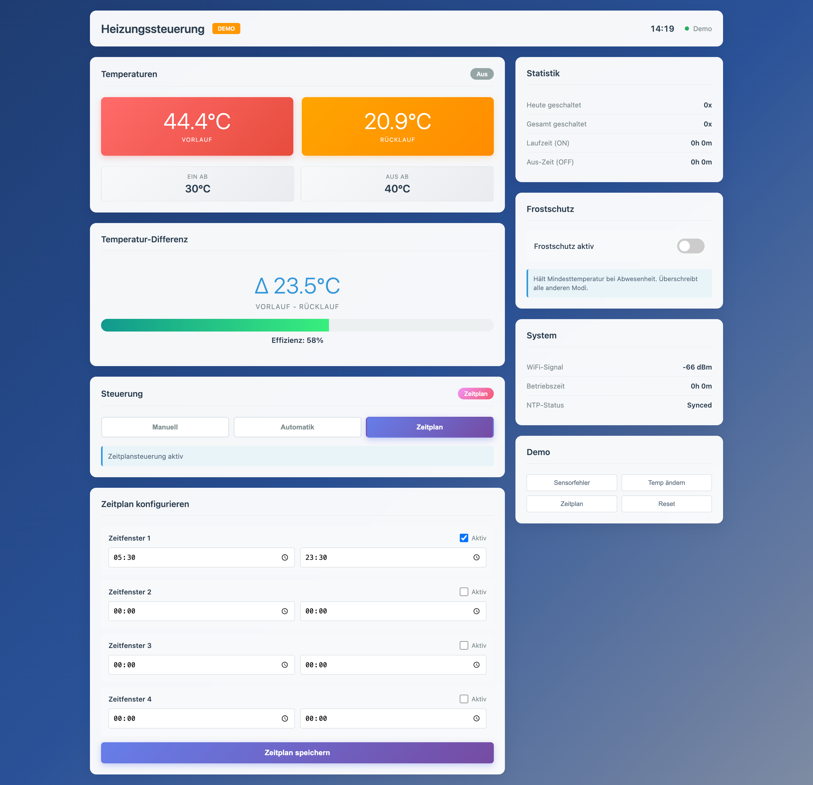
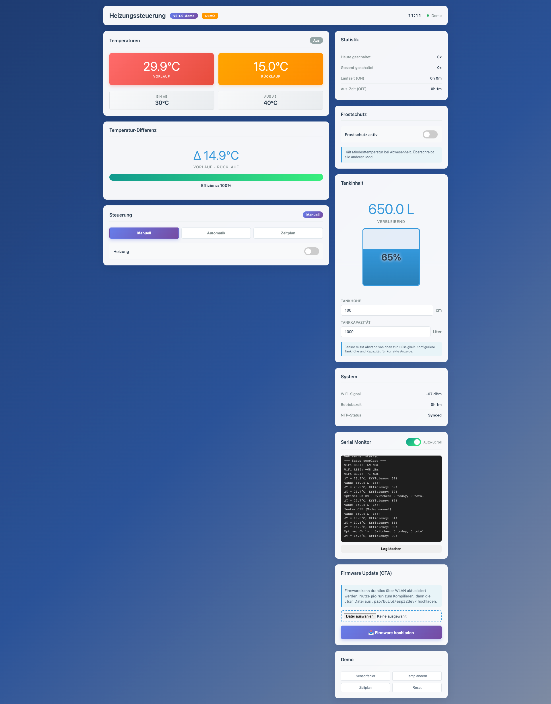
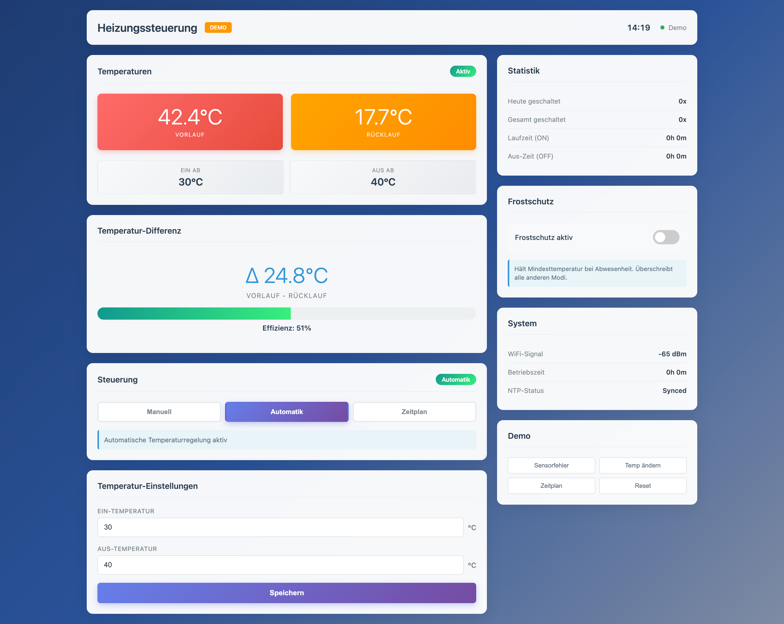

# ESP32 Heizungssteuerung - Web UI

**Version: 2.3.0** | ESP32 DevKit V1 | Arduino Framework | PlatformIO

Ein vollständiges PlatformIO-Projekt zur Steuerung einer Heizung über ESP32 mit Web-Interface.

## 📸 Dashboard

### Automatik-Modus (Hysterese)


**Temperaturbasierte Regelung** mit konfigurierbarer Hysterese:
- **Dual-Temperatur**: Vorlauf (rot) & Rücklauf (orange) in Echtzeit
- **Effizienz-Anzeige**: Temperatur-Differenz & Performance-Meter
- **Einstellbare Schwellwerte**: EIN-Temperatur (30°C) / AUS-Temperatur (40°C)

### Zeitplan-Modus


**Zeitbasierte Steuerung** mit bis zu 4 Zeitfenstern:
- **4 individuelle Zeitfenster**: z.B. 05:30 - 23:30 Uhr
- **Übernacht-Support**: Zeitfenster über Mitternacht möglich
- **Einzeln aktivierbar**: Jedes Fenster kann separat ein-/ausgeschaltet werden

### Demo-Modus & Monitoring


**Lokales Testen und Live-Debugging**:
- **Demo-Modus**: Vollständig funktionsfähig ohne Hardware (lokales Testing)
- **Serial Monitor**: Live-Logs im Dashboard per WebSocket
- **OTA Updates**: Firmware UND Frontend drahtlos hochladen
- **Versionsanzeige**: Aktuelle Firmware-Version im Header (v2.2.0)

### Weitere Features


**Umfassende Monitoring-Funktionen**:
- **Statistik**: Schalt-Counter (heute/gesamt), Laufzeiten (ON/OFF)
- **Frostschutz**: Automatische Mindesttemperatur-Überwachung
- **System-Info**: WiFi-Signal, Betriebszeit, NTP-Status
- **3 Modi**: Manuell, Automatik (Hysterese), Zeitplan
- **Responsive**: Optimiert für Desktop & Mobile

## 📋 Features

### Steuerung
- ✅ **Manueller Modus**: Direkte Ein/Aus-Schaltung über Web-Interface
- ✅ **Automatik-Modus**: Temperaturbasierte Regelung mit Hysterese
- ✅ **Zeitplan-Modus**: Bis zu 4 Zeitfenster für automatische Steuerung
- ✅ **Hysterese-Einstellungen**: Konfigurierbare EIN/AUS-Temperaturen
- ✅ **Dual-Temperatur**: Vorlauf- UND Rücklauftemperatur parallel

### Sicherheit
- ✅ **Failsafe**: Bei Sensorfehler wird Heizung automatisch ausgeschaltet
- ✅ **NVS-Persistenz**: Einstellungen bleiben nach Reboot erhalten
- ✅ **Basic Auth**: Geschützte API-Endpunkte
- ✅ **Debounce**: Schutz vor versehentlichen Mehrfachschaltungen

### Netzwerk
- ✅ **mDNS**: Erreichbar unter `http://heater.local/`
- ✅ **WiFi-Fallback**: Access Point Mode bei fehlgeschlagener Verbindung
- ✅ **NTP-Zeitsynchronisation** (Europa/Berlin)
- ✅ **System-Info**: RSSI, Betriebszeit

### Monitoring
- ✅ **Tankfüllstand**: Ultraschall-Sensor für Heizöl/Pellets-Füllstand (optional)
- ✅ **Temperatur-Differenz & Effizienz**: Vorlauf-Rücklauf-Analyse
- ✅ **Schalt-Statistiken**: Zähler für tägliche/gesamte Schaltvorgänge
- ✅ **Laufzeit-Tracking**: ON/OFF-Zeiten
- ✅ **Wetter-Widget**: Open-Meteo API mit Standort-Eingabe (Stadt/PLZ), Geocoding

### Benachrichtigungen
- ✅ **Telegram-Bot**: Push-Benachrichtigungen bei wichtigen Events
- ✅ **Heizungs-Status**: Automatische Meldung bei EIN/AUS
- ✅ **Sensor-Fehler**: Alarm wenn Sensoren ausfallen (+ Recovery-Meldung)
- ✅ **Tank-Level**: Warnung bei niedrigem Füllstand (< 20%)
- ✅ **Test-Funktion**: Test-Nachricht direkt aus dem Dashboard

### Interface
- ✅ **Professionelles Dashboard-Design**
- ✅ **Responsive**: Funktioniert auf Desktop & Mobile
- ✅ **Demo-Modus**: Lokales Testen ohne Hardware möglich
- ✅ **Versionsanzeige**: Aktuelle Firmware-Version im Header
- ✅ **OTA Updates**: Firmware UND Frontend drahtlos über WLAN aktualisieren
- ✅ **Dual-OTA**: Separate Upload-Interfaces für C++ Code und HTML/CSS/JS
- ✅ **Serial Monitor**: Live-Logs im Dashboard per WebSocket

## 🔌 Hardware

### Benötigte Komponenten

| Komponente | Anzahl | Beschreibung |
|------------|--------|--------------|
| **ESP32 DevKit V1 (WROOM-32) USB-C (30 PIN)** | 1x | Mikrocontroller mit WiFi & Bluetooth |
| **DS18B20 Temperatursensor** (wasserdicht) | 2x | Vorlauf- & Rücklauftemperatur |
| **JSN-SR04T Ultraschall-Sensor** (wasserdicht) | 1x | Tankfüllstand-Messung (optional) |
| **1-Kanal Relais-Modul** (Active-Low) | 1x | Heizungsschaltung (bis 10A) |
| **LM2596S Spannungsregler** (DC-DC Step-Down) | 1x | Für stabile 5V-Versorgung |
| **4.7 kΩ Widerstand** | 1x | Pull-Up für OneWire-Bus |

### Pinbelegung

| Komponente | Pin | Beschreibung |
|------------|-----|--------------|
| DS18B20 #1 (Vorlauf) | GPIO4 | One-Wire Bus |
| DS18B20 #2 (Rücklauf) | GPIO4 | One-Wire Bus (parallel) |
| Pull-Up Widerstand | GPIO4 → 3.3V | 4.7kΩ (einer für beide Sensoren) |
| JSN-SR04T TRIG | GPIO5 | Ultraschall Trigger |
| JSN-SR04T ECHO | GPIO18 | Ultraschall Echo |
| JSN-SR04T VCC | 5V | Versorgung |
| JSN-SR04T GND | GND | Gemeinsame Masse |
| Relais IN | GPIO23 | Active-Low (LOW=EIN, HIGH=AUS) |
| Relais VCC | 5V | Externe Versorgung |
| Relais GND | GND | Gemeinsame Masse |

### Sensor-Anschluss

**Beide DS18B20 parallel am gleichen OneWire-Bus:**
- Alle **GND** zusammen an ESP32 GND
- Alle **VDD** zusammen an ESP32 3.3V
- Alle **DATA** zusammen an GPIO4
- **Ein** 4.7kΩ Pull-Up zwischen DATA und 3.3V

Jeder DS18B20 hat eine eindeutige 64-Bit-Adresse → automatische Erkennung durch Software!

**JSN-SR04T Ultraschall-Sensor (optional):**
- **VCC** → ESP32 5V (oder externe 5V)
- **GND** → ESP32 GND
- **TRIG** → ESP32 GPIO5
- **ECHO** → ESP32 GPIO18
- **Montage**: Von oben in den Tank schauen (misst Abstand zur Flüssigkeitsoberfläche)
- **Messbereich**: 25 cm - 450 cm
- **Wasserdicht**: IP67 (Sensor-Kopf kann eingetaucht werden)

### Schaltlogik
- **Relais Active-Low mit Open-Drain-Mode**: 
  - `GPIO23 = LOW` (OUTPUT-Mode) → Relais EIN → Heizung läuft
  - `GPIO23 = HIGH` (OUTPUT_OPEN_DRAIN-Mode) → Relais AUS → Heizung ruht
  
  **Hinweis:** Das HW-307 Relais-Modul erkennt 3.3V HIGH nicht zuverlässig. Daher wird Open-Drain-Mode für HIGH verwendet (Pin ist "floating" und wird vom internen Pull-Up des Relais-Moduls auf HIGH gezogen).

## 🚀 Installation

### 1. Voraussetzungen
- [PlatformIO IDE](https://platformio.org/install/ide?install=vscode) (VS Code Extension)
- USB-Kabel für ESP32

### 2. WiFi-Credentials konfigurieren

Öffne `include/secrets.h` und trage deine WiFi-Daten ein:

```cpp
const char* WIFI_SSID = "Dein_WLAN_Name";
const char* WIFI_PASSWORD = "Dein_WLAN_Passwort";
```

### 3. Projekt kompilieren

```bash
pio run
```

### 4. Firmware hochladen

**WICHTIG**: Reihenfolge beachten!

```bash
# Schritt 1: Firmware flashen
pio run -t upload

# Schritt 2: LittleFS (Web-Interface) hochladen
pio run -t uploadfs
```

### 5. Serial Monitor starten (optional)

```bash
pio device monitor
```

### 6. OTA Updates (nach erstem Flash)

Nach dem ersten Upload über USB kannst du **alle zukünftigen Updates drahtlos** durchführen:

**Für Firmware-Updates (C++ Code):**
```bash
# 1. Kompilieren
pio run

# 2. Im Dashboard → "🔧 Firmware Update (OTA)"
#    → Datei wählen: .pio/build/esp32dev/firmware.bin
#    → "Firmware hochladen" klicken
#    → ESP32 startet automatisch neu (~10 Sekunden)
```

**Für Frontend-Updates (HTML/CSS/JS):**
```bash
# 1. LittleFS kompilieren
pio run -t buildfs

# 2. Im Dashboard → "🎨 Frontend Update (OTA)"
#    → Datei wählen: .pio/build/esp32dev/littlefs.bin
#    → "Frontend hochladen" klicken
#    → ESP32 startet automatisch neu (~10 Sekunden)
```

**💡 Vorteil:** Nach dem ersten USB-Flash kannst du **beide Updates komplett über WLAN** durchführen! Perfekt für fest verbaute Systeme.

## 🌐 Verwendung

### Normalbetrieb (WiFi verbunden)

1. Nach dem Upload ist das Interface unter folgender URL erreichbar:
   - **http://heater.local/** (via mDNS)
   - oder direkt über die IP-Adresse (siehe Serial Monitor)

2. **Login-Daten** für API-Zugriffe:
   - Benutzername: `admin`
   - Passwort: `admin`

### Steuerungsmodi

#### 1. Manueller Modus
- Direktes Ein-/Ausschalten der Heizung über Toggle-Schalter
- Zustand wird in NVS gespeichert
- Ideal für Testzwecke oder temporäre Nutzung

#### 2. Automatik-Modus (Hysterese)
- **Regelung basierend auf Rücklauftemperatur**
- **EIN-Temperatur**: Unterschreitet die Rücklauftemp. diesen Wert → Heizung EIN
- **AUS-Temperatur**: Überschreitet die Rücklauftemp. diesen Wert → Heizung AUS
- **Beispiel**: EIN=30°C, AUS=40°C
  - Rücklauf fällt auf 29°C → Heizung AN
  - Rücklauf steigt auf 40°C → Heizung AUS
  - Rücklauf fällt wieder unter 30°C → Heizung AN
- Verhindert häufiges Ein-/Ausschalten (Relaisschutz)

#### 3. Zeitplan-Modus (Scheduler)
- **Bis zu 4 unabhängige Zeitfenster**
- **Beispiele**:
  - Zeitfenster 1: 05:30 - 23:30 (täglicher Betrieb)
  - Zeitfenster 2: 02:00 - 04:00 (Nachtabsenkung vermeiden)
- **Übernacht-Zeitfenster** möglich (z.B. 22:00 - 06:00)
- **NTP-Synchronisation** erforderlich (automatisch bei WiFi-Verbindung)
- Jedes Zeitfenster einzeln aktivierbar

### Fallback: Access Point Mode

Falls keine WiFi-Verbindung innerhalb von 20 Sekunden möglich ist:

1. ESP32 erstellt eigenes WLAN:
   - **SSID**: `HeaterSetup`
   - **Passwort**: `12345678`

2. Mit diesem WLAN verbinden

3. Interface erreichbar unter:
   - **http://192.168.4.1/**

## 📡 API-Endpunkte

### GET /api/status
Liefert aktuellen Status:

```json
{
  "version": "v2.2.0",
  "tempVorlauf": 48.5,
  "tempRuecklauf": 35.5,
  "heating": true,
  "mode": "schedule",
  "tempOn": 30.0,
  "tempOff": 40.0,
  "relayActiveLow": true,
  "rssi": -67,
  "apMode": false,
  "uptime": 3600,
  "ntpSynced": true,
  "currentTime": "14:30",
  "tempDiff": 13.0,
  "efficiency": 100,
  "switchCount": 42,
  "todaySwitches": 5,
  "onTimeSeconds": 7200,
  "offTimeSeconds": 3600,
  "frostEnabled": false,
  "frostTemp": 8.0,
  "tankAvailable": true,
  "tankDistance": 35.0,
  "tankLiters": 650.0,
  "tankPercent": 65,
  "tankHeight": 100.0,
  "tankCapacity": 1000.0,
  "schedules": [
    {
      "enabled": true,
      "start": "05:30",
      "end": "23:30"
    },
    {
      "enabled": false,
      "start": "00:00",
      "end": "00:00"
    }
  ]
}
```

### GET /api/toggle
Schaltet Heizung im manuellen Modus um (benötigt Basic Auth)

Response:
```json
{
  "success": true,
  "heating": true
}
```

**Hinweis**: Nur im manuellen Modus verfügbar!

### POST /api/settings
Speichert Einstellungen (benötigt Basic Auth)

Body:
```json
{
  "mode": "schedule",
  "tempOn": 30.0,
  "tempOff": 40.0,
  "frostEnabled": false,
  "frostTemp": 8.0,
  "tankHeight": 100.0,
  "tankCapacity": 1000.0,
  "schedules": [
    {
      "enabled": true,
      "start": "05:30",
      "end": "23:30"
    },
    {
      "enabled": true,
      "start": "02:00",
      "end": "04:00"
    }
  ]
}
```

Response:
```json
{
  "success": true
}
```

**Parameter:**
- `mode`: "manual", "auto" oder "schedule"
- `tempOn`: EIN-Temperatur (0-100°C, nur für auto-Modus)
- `tempOff`: AUS-Temperatur (0-100°C, muss > tempOn sein)
- `frostEnabled`: Frostschutz aktiviert (true/false)
- `frostTemp`: Mindesttemperatur für Frostschutz (5-15°C)
- `tankHeight`: Tankhöhe in cm (10-500)
- `tankCapacity`: Tankkapazität in Litern (10-10000)
- `schedules`: Array mit bis zu 4 Zeitfenstern
  - `enabled`: true/false
  - `start`: "HH:MM" (z.B. "05:30")
  - `end`: "HH:MM" (z.B. "23:30")

## 🛡️ Failsafe-Mechanismen

- **Sensor-Überwachung**: Bei Sensorfehler (NaN, Kabelbruch) → Heizung AUS
- **Default-Zustand**: Beim Boot ist Relais standardmäßig AUS (HIGH)
- **Persistenz**: Einstellungen und Zustand werden in NVS gespeichert
- **Hysterese-Validierung**: AUS-Temperatur muss höher sein als EIN-Temperatur
- **Debounce**: 300ms Sperre nach jedem manuellen Toggle
- **Automatik-Sicherheit**: Im Auto-Modus wird Heizung nur basierend auf Temperatur gesteuert

## 🔧 Anpassungen

### Basic Auth ändern
In `include/secrets.h`:
```cpp
const char* AUTH_USER = "dein_user";
const char* AUTH_PASS = "dein_passwort";
```

### Hostname ändern
In `src/main.cpp`:
```cpp
#define HOSTNAME "dein_name"  // erreichbar unter http://dein_name.local/
```

### Zeitzone anpassen
In `src/main.cpp`:
```cpp
#define TIMEZONE "CET-1CEST,M3.5.0,M10.5.0/3"  // Europe/Berlin
```

## 📊 Serial Monitor & Debugging

### Im Dashboard (WebSocket)

Das Dashboard enthält einen **Live Serial Monitor** mit WebSocket-Verbindung:
- Zeigt alle `Serial.print()` Ausgaben in Echtzeit
- Auto-Scroll (umschaltbar)
- Buffer: Letzte 50 Zeilen auf ESP32, 200 im Browser
- Automatische Wiederverbindung bei Netzwerkfehlern
- Erreichbar unter: `ws://heater.local/ws` oder `ws://192.168.1.100/ws`

### Über USB (Terminal)

Bei erfolgreichem Start solltest du sehen:

```
=== ESP32 Heater Control ===
LittleFS mounted successfully
Found 1 DS18B20 sensor(s)
Restored state from NVS: Heating OFF
Connecting to WiFi 'Dein_WLAN'.....
WiFi connected! IP: 192.168.1.100
RSSI: -65 dBm
mDNS responder started: http://heater.local/
NTP time sync initiated
Current time: 14:30:15
Web server started
Current temperature: 22.5°C
=== Setup complete ===
```

## 📱 Telegram-Benachrichtigungen (optional)

### Bot erstellen

1. **Telegram öffnen** und nach `@BotFather` suchen
2. **Bot erstellen** mit `/newbot`
3. **Namen eingeben** (z.B. "Heizungssteuerung")
4. **Username** (muss auf `bot` enden, z.B. "s3v_heizung_bot")
5. **Bot Token kopieren** (z.B. `1234567890:ABCdefGHIjklMNOpqrsTUVwxyz`)

### Chat ID ermitteln

1. **Starte Chat** mit deinem Bot
2. **Sende Nachricht** (z.B. "Hallo")
3. **Öffne im Browser**:
   ```
   https://api.telegram.org/bot<DEIN_BOT_TOKEN>/getUpdates
   ```
4. **Suche** nach `"chat":{"id":123456789` → Das ist deine Chat ID!

### Konfiguration

Trage in `include/secrets.h` ein:

```cpp
const char* TELEGRAM_BOT_TOKEN = "1234567890:ABCdefGHIjklMNOpqrsTUVwxyz";
const char* TELEGRAM_CHAT_ID = "123456789";
```

### Testen

1. Firmware flashen: `pio run -t upload`
2. Dashboard öffnen: `http://heater.local/`
3. Zu "📱 Telegram-Benachrichtigungen" scrollen
4. **"Test-Nachricht senden"** klicken
5. Telegram prüfen → Du solltest eine Nachricht bekommen! 🎉

### Automatische Benachrichtigungen

Der ESP32 sendet automatisch Telegram-Nachrichten bei:

- 🔥 **Heizung EIN/AUS** (mit Modus & Temperatur)
- ⚠️ **Sensor-Fehler** (wenn beide DS18B20 ausfallen)
- ✅ **Sensoren wieder OK** (nach Recovery)
- 🪫 **Tank niedrig** (< 20% Füllstand)

## 🐛 Troubleshooting

### Problem: WiFi verbindet nicht
- **Lösung**: Credentials in `secrets.h` prüfen
- **Fallback**: ESP32 startet automatisch im AP-Mode nach 20s

### Problem: Sensor zeigt "Sensor fehlt!"
- **Check**: Verkabelung prüfen (GPIO4, Pull-Up 4.7kΩ)
- **Sicherheit**: Heizung wird automatisch ausgeschaltet

### Problem: mDNS funktioniert nicht
- **Windows**: [Bonjour Service](https://support.apple.com/kb/DL999) installieren
- **Alternative**: Direkt über IP-Adresse zugreifen (siehe Serial Monitor)

### Problem: Relais schaltet nicht
- **Check**: Pinbelegung GPIO23 prüfen
- **Check**: Relais-Versorgung (5V, GND)
- **Test**: Logik ist Active-Low (LOW = EIN)

### Problem: Upload schlägt fehl
- **Lösung**: ESP32 beim Upload **BOOT-Button** gedrückt halten
- **Tipp**: USB-Kabel direkt am PC (nicht über Hub)

## ✅ Implementierte Features (v2.3.0)

Alle wichtigen Features sind implementiert:

- ✅ **Zeitpläne (Scheduler)** - Bis zu 4 Zeitfenster mit NTP-Zeit
- ✅ **Temperatur-Schwellwerte (Hysterese)** - Automatische Regelung
- ✅ **Logging / Statistiken** - Schalt-Counter, Laufzeiten, Serial Monitor
- ✅ **OTA-Updates (Over-The-Air)** - Firmware UND Frontend drahtlos
- ✅ **Dual-Temperatur** - Vorlauf & Rücklauf mit Effizienz-Berechnung
- ✅ **Frostschutz** - Automatische Mindesttemperatur
- ✅ **Tankfüllstand** - JSN-SR04T Ultraschall-Sensor (optional)
- ✅ **Serial Monitor** - Live-Logs per WebSocket im Dashboard
- ✅ **Wetter-Widget** - Open-Meteo API mit Standort-Eingabe (Stadt/PLZ)
- ✅ **Telegram-Bot** - Push-Benachrichtigungen bei wichtigen Events

## 🔮 Mögliche Erweiterungen

- [ ] Grafana/InfluxDB Integration für Langzeit-Statistiken
- [ ] Mehrere Heizkreise parallel
- [ ] Täglicher Status-Report per Telegram (z.B. um 06:00 Uhr)


## 📝 Lizenz

Dieses Projekt ist frei verwendbar für private und kommerzielle Zwecke.

---

**Viel Erfolg mit deiner ESP32-Heizungssteuerung! 🔥**

