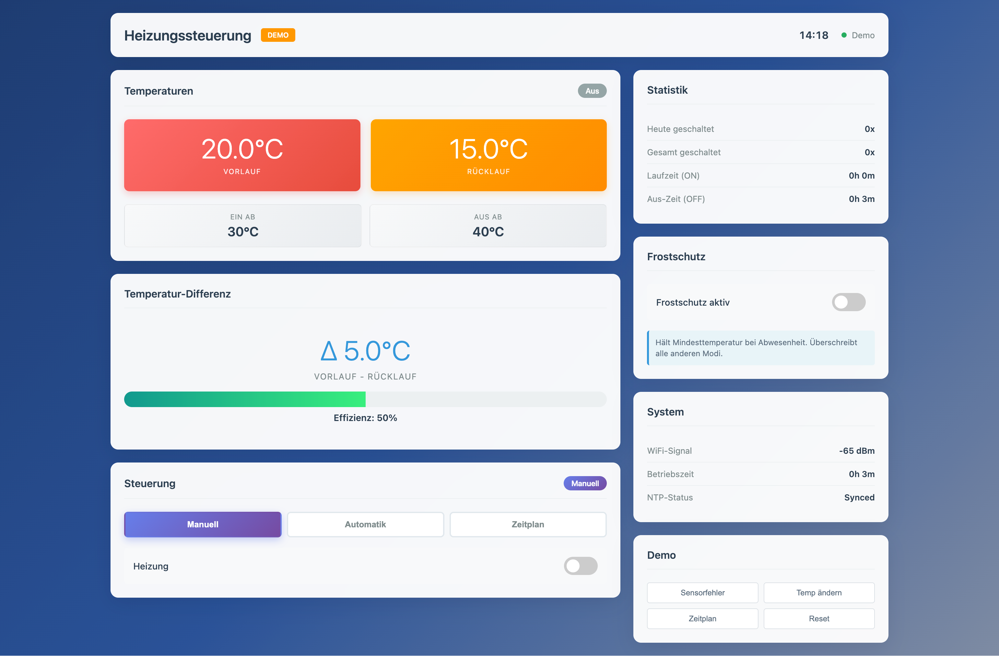

# ESP32 Heizungssteuerung - Web UI

Ein vollständiges PlatformIO-Projekt zur Steuerung einer Heizung über ESP32 mit Web-Interface.

## 📸 Dashboard

### Automatik-Modus (Hysterese)


**Temperaturbasierte Regelung** mit konfigurierbarer Hysterese:
- 🌡️ **Dual-Temperatur**: Vorlauf (rot) & Rücklauf (orange) in Echtzeit
- 📊 **Effizienz-Anzeige**: Temperatur-Differenz & Performance-Meter
- ⚙️ **Einstellbare Schwellwerte**: EIN-Temperatur (30°C) / AUS-Temperatur (40°C)

### Zeitplan-Modus


**Zeitbasierte Steuerung** mit bis zu 4 Zeitfenstern:
- ⏰ **4 individuelle Zeitfenster**: z.B. 05:30 - 23:30 Uhr
- 🌙 **Übernacht-Support**: Zeitfenster über Mitternacht möglich
- ☑️ **Einzeln aktivierbar**: Jedes Fenster kann separat ein-/ausgeschaltet werden

### Weitere Features


**Umfassende Monitoring-Funktionen**:
- 📈 **Statistik**: Schalt-Counter (heute/gesamt), Laufzeiten (ON/OFF)
- ❄️ **Frostschutz**: Automatische Mindesttemperatur-Überwachung
- 📡 **System-Info**: WiFi-Signal, Betriebszeit, NTP-Status
- 🎛️ **3 Modi**: Manuell, Automatik (Hysterese), Zeitplan
- 📱 **Responsive**: Optimiert für Desktop & Mobile

## 📋 Features

### Steuerung
- ✅ **Manueller Modus**: Direkte Ein/Aus-Schaltung über Web-Interface
- ✅ **Automatik-Modus**: Temperaturbasierte Regelung mit Hysterese
- ✅ **Zeitplan-Modus**: Bis zu 4 Zeitfenster für automatische Steuerung
- ✅ **Hysterese-Einstellungen**: Konfigurierbare EIN/AUS-Temperaturen
- ✅ **Dual-Temperatur**: Vorlauf- UND Rücklauftemperatur parallel

### Sicherheit
- ✅ **Failsafe**: Bei Sensorfehler wird Heizung automatisch ausgeschaltet
- ✅ **NVS-Persistenz**: Einstellungen bleiben nach Reboot erhalten
- ✅ **Basic Auth**: Geschützte API-Endpunkte
- ✅ **Debounce**: Schutz vor versehentlichen Mehrfachschaltungen

### Netzwerk
- ✅ **mDNS**: Erreichbar unter `http://heater.local/`
- ✅ **WiFi-Fallback**: Access Point Mode bei fehlgeschlagener Verbindung
- ✅ **NTP-Zeitsynchronisation** (Europa/Berlin)
- ✅ **System-Info**: RSSI, Betriebszeit

### Interface
- ✅ **Professionelles Dashboard-Design**
- ✅ **Responsive**: Funktioniert auf Desktop & Mobile
- ✅ **Demo-Modus**: Lokales Testen ohne Hardware möglich

## 🔌 Hardware

### Benötigte Komponenten

| Komponente | Anzahl | Beschreibung |
|------------|--------|--------------|
| **ESP32 DevKit V1 (WROOM-32) USB-C** | 1x | Mikrocontroller mit WiFi & Bluetooth |
| **DS18B20 Temperatursensor** (wasserdicht) | 2x | Vorlauf- & Rücklauftemperatur |
| **1-Kanal Relais-Modul** (Active-Low) | 1x | Heizungsschaltung (bis 10A) |
| **LM2596S Spannungsregler** (DC-DC Step-Down) | 1x | Für stabile 5V-Versorgung |
| **4.7 kΩ Widerstand** | 1x | Pull-Up für OneWire-Bus |

### Pinbelegung

| Komponente | Pin | Beschreibung |
|------------|-----|--------------|
| DS18B20 #1 (Vorlauf) | GPIO4 | One-Wire Bus |
| DS18B20 #2 (Rücklauf) | GPIO4 | One-Wire Bus (parallel) |
| Pull-Up Widerstand | GPIO4 → 3.3V | 4.7kΩ (einer für beide Sensoren) |
| Relais IN | GPIO23 | Active-Low (LOW=EIN, HIGH=AUS) |
| Relais VCC | 5V | Externe Versorgung |
| Relais GND | GND | Gemeinsame Masse |

### Sensor-Anschluss
**Beide DS18B20 parallel am gleichen OneWire-Bus:**
- Alle **GND** zusammen an ESP32 GND
- Alle **VDD** zusammen an ESP32 3.3V
- Alle **DATA** zusammen an GPIO4
- **Ein** 4.7kΩ Pull-Up zwischen DATA und 3.3V

Jeder DS18B20 hat eine eindeutige 64-Bit-Adresse → automatische Erkennung durch Software!

### Schaltlogik
- **Relais Active-Low**: 
  - `GPIO23 = LOW` → Relais EIN → Heizung läuft
  - `GPIO23 = HIGH` → Relais AUS → Heizung ruht

## 🚀 Installation

### 1. Voraussetzungen
- [PlatformIO IDE](https://platformio.org/install/ide?install=vscode) (VS Code Extension)
- USB-Kabel für ESP32

### 2. WiFi-Credentials konfigurieren

Öffne `include/secrets.h` und trage deine WiFi-Daten ein:

```cpp
const char* WIFI_SSID = "Dein_WLAN_Name";
const char* WIFI_PASSWORD = "Dein_WLAN_Passwort";
```

### 3. Projekt kompilieren

```bash
pio run
```

### 4. Firmware hochladen

**WICHTIG**: Reihenfolge beachten!

```bash
# Schritt 1: Firmware flashen
pio run -t upload

# Schritt 2: LittleFS (Web-Interface) hochladen
pio run -t uploadfs
```

### 5. Serial Monitor starten (optional)

```bash
pio device monitor
```

## 🌐 Verwendung

### Normalbetrieb (WiFi verbunden)

1. Nach dem Upload ist das Interface unter folgender URL erreichbar:
   - **http://heater.local/** (via mDNS)
   - oder direkt über die IP-Adresse (siehe Serial Monitor)

2. **Login-Daten** für API-Zugriffe:
   - Benutzername: `admin`
   - Passwort: `admin`

### Steuerungsmodi

#### 1. Manueller Modus
- Direktes Ein-/Ausschalten der Heizung über Toggle-Schalter
- Zustand wird in NVS gespeichert
- Ideal für Testzwecke oder temporäre Nutzung

#### 2. Automatik-Modus (Hysterese)
- **Regelung basierend auf Rücklauftemperatur**
- **EIN-Temperatur**: Unterschreitet die Rücklauftemp. diesen Wert → Heizung EIN
- **AUS-Temperatur**: Überschreitet die Rücklauftemp. diesen Wert → Heizung AUS
- **Beispiel**: EIN=30°C, AUS=40°C
  - Rücklauf fällt auf 29°C → Heizung AN
  - Rücklauf steigt auf 40°C → Heizung AUS
  - Rücklauf fällt wieder unter 30°C → Heizung AN
- Verhindert häufiges Ein-/Ausschalten (Relaisschutz)

#### 3. Zeitplan-Modus (Scheduler)
- **Bis zu 4 unabhängige Zeitfenster**
- **Beispiele**:
  - Zeitfenster 1: 05:30 - 23:30 (täglicher Betrieb)
  - Zeitfenster 2: 02:00 - 04:00 (Nachtabsenkung vermeiden)
- **Übernacht-Zeitfenster** möglich (z.B. 22:00 - 06:00)
- **NTP-Synchronisation** erforderlich (automatisch bei WiFi-Verbindung)
- Jedes Zeitfenster einzeln aktivierbar

### Fallback: Access Point Mode

Falls keine WiFi-Verbindung innerhalb von 20 Sekunden möglich ist:

1. ESP32 erstellt eigenes WLAN:
   - **SSID**: `HeaterSetup`
   - **Passwort**: `12345678`

2. Mit diesem WLAN verbinden

3. Interface erreichbar unter:
   - **http://192.168.4.1/**

## 📡 API-Endpunkte

### GET /api/status
Liefert aktuellen Status:

```json
{
  "tempVorlauf": 48.5,
  "tempRuecklauf": 35.5,
  "heating": true,
  "mode": "schedule",
  "tempOn": 30.0,
  "tempOff": 40.0,
  "relayActiveLow": true,
  "rssi": -67,
  "apMode": false,
  "uptime": 3600,
  "ntpSynced": true,
  "currentTime": "14:30",
  "schedules": [
    {
      "enabled": true,
      "start": "05:30",
      "end": "23:30"
    },
    {
      "enabled": false,
      "start": "00:00",
      "end": "00:00"
    }
  ]
}
```

### GET /api/toggle
Schaltet Heizung im manuellen Modus um (benötigt Basic Auth)

Response:
```json
{
  "success": true,
  "heating": true
}
```

**Hinweis**: Nur im manuellen Modus verfügbar!

### POST /api/settings
Speichert Einstellungen (benötigt Basic Auth)

Body:
```json
{
  "mode": "schedule",
  "tempOn": 30.0,
  "tempOff": 40.0,
  "schedules": [
    {
      "enabled": true,
      "start": "05:30",
      "end": "23:30"
    },
    {
      "enabled": true,
      "start": "02:00",
      "end": "04:00"
    }
  ]
}
```

Response:
```json
{
  "success": true
}
```

**Parameter:**
- `mode`: "manual", "auto" oder "schedule"
- `tempOn`: EIN-Temperatur (0-100°C, nur für auto-Modus)
- `tempOff`: AUS-Temperatur (0-100°C, muss > tempOn sein)
- `schedules`: Array mit bis zu 4 Zeitfenstern
  - `enabled`: true/false
  - `start`: "HH:MM" (z.B. "05:30")
  - `end`: "HH:MM" (z.B. "23:30")

## 🛡️ Failsafe-Mechanismen

- **Sensor-Überwachung**: Bei Sensorfehler (NaN, Kabelbruch) → Heizung AUS
- **Default-Zustand**: Beim Boot ist Relais standardmäßig AUS (HIGH)
- **Persistenz**: Einstellungen und Zustand werden in NVS gespeichert
- **Hysterese-Validierung**: AUS-Temperatur muss höher sein als EIN-Temperatur
- **Debounce**: 300ms Sperre nach jedem manuellen Toggle
- **Automatik-Sicherheit**: Im Auto-Modus wird Heizung nur basierend auf Temperatur gesteuert

## 🔧 Anpassungen

### Basic Auth ändern
In `include/secrets.h`:
```cpp
const char* AUTH_USER = "dein_user";
const char* AUTH_PASS = "dein_passwort";
```

### Hostname ändern
In `src/main.cpp`:
```cpp
#define HOSTNAME "dein_name"  // erreichbar unter http://dein_name.local/
```

### Zeitzone anpassen
In `src/main.cpp`:
```cpp
#define TIMEZONE "CET-1CEST,M3.5.0,M10.5.0/3"  // Europe/Berlin
```

## 📊 Serial Monitor Ausgaben

Bei erfolgreichem Start solltest du sehen:

```
=== ESP32 Heater Control ===
LittleFS mounted successfully
Found 1 DS18B20 sensor(s)
Restored state from NVS: Heating OFF
Connecting to WiFi 'Dein_WLAN'.....
WiFi connected! IP: 192.168.1.100
RSSI: -65 dBm
mDNS responder started: http://heater.local/
NTP time sync initiated
Current time: 14:30:15
Web server started
Current temperature: 22.5°C
=== Setup complete ===
```

## 🐛 Troubleshooting

### Problem: WiFi verbindet nicht
- **Lösung**: Credentials in `secrets.h` prüfen
- **Fallback**: ESP32 startet automatisch im AP-Mode nach 20s

### Problem: Sensor zeigt "Sensor fehlt!"
- **Check**: Verkabelung prüfen (GPIO4, Pull-Up 4.7kΩ)
- **Sicherheit**: Heizung wird automatisch ausgeschaltet

### Problem: mDNS funktioniert nicht
- **Windows**: [Bonjour Service](https://support.apple.com/kb/DL999) installieren
- **Alternative**: Direkt über IP-Adresse zugreifen (siehe Serial Monitor)

### Problem: Relais schaltet nicht
- **Check**: Pinbelegung GPIO23 prüfen
- **Check**: Relais-Versorgung (5V, GND)
- **Test**: Logik ist Active-Low (LOW = EIN)

### Problem: Upload schlägt fehl
- **Lösung**: ESP32 beim Upload **BOOT-Button** gedrückt halten
- **Tipp**: USB-Kabel direkt am PC (nicht über Hub)

## 📝 Lizenz

Dieses Projekt ist frei verwendbar für private und kommerzielle Zwecke.

## 🔮 Geplante Erweiterungen (optional)

- [ ] Zeitpläne (Scheduler mit NTP-Zeit)
- [ ] Temperatur-Schwellwerte (automatische Regelung)
- [ ] Logging / Statistiken
- [ ] OTA-Updates (Over-The-Air)
- [ ] Telegram-Bot Integration

---

**Viel Erfolg mit deiner ESP32-Heizungssteuerung! 🔥**

